# 教室で使えるかもしれないもの作り #◯ 「あと5分、なにしよう」を埋める。ルール3つで始まる2人対戦ゲーム「南極スライダー」

## 🏫 はじめに

授業が思ったより早く終わって、5分だけ手もちぶさたな時間ができてしまうこと、ありませんか。

チャイムまであと少し。宿題を出すには短いし、次の準備をさせるには長い。とりあえず端末を開かせてみるものの、何をさせるか決めていないので結局ざわざわして終わる。そんな5分の使いみちに困ることは、少なくないのではないでしょうか。

かといって、そこにゲームを持ちこもうとすると、今度は別の壁にぶつかります。ルールの説明です。遊びかたを話しているうちに5分が終わってしまうようでは、本末転倒になってしまいます。子どもたちのほうも、説明を聞き終わるころには気持ちが冷めています。

だから、説明が10秒で済むものを作りました。氷の上をすべる2人対戦ゲーム「南極スライダー」です。

https://gigayama.github.io/Ice_slide-puzzle/

覚えることは3つしかありません。コマをえらぶ。すべらせる。王冠のついたコマを、まん中のかき氷にぴったり止める。これだけです。ブラウザを開けばすぐ始まりますし、名前を入れる画面も、ログインの画面もありません。

今回は学習のアプリではありません。ただのゲームです。それでも先生方にお届けしたいと思ったのは、この「すぐ始められて、すぐ終わる」という形そのものが、教室のすきま時間と相性がいいのではないかと考えたからです。

## 📱 このアプリでできること

開くと、5かける5の25マスの氷の盤が出てきます。上の段にペンギンのコマが5つ、下の段にアザラシのコマが5つ。それぞれ1つだけ、王冠をかぶった特別なコマがまじっています。まん中にあるのが、ゴールのかき氷です。

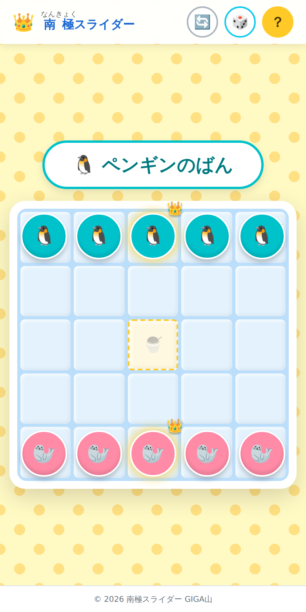

開いたところ。上がペンギンチーム、下がアザラシチームです。

画面の右上には3つのボタンがあります。左からやりなおし、サイコロ、あそびかた。子どもが押して困るものは置いていません。

あそびかたのボタンを押すと、遊びかたが3枚のカードで出てきます。文字にはすべてふりがなをふってあります。低学年の子でも、大人が横についていなくても読めるようにしたかったからです。

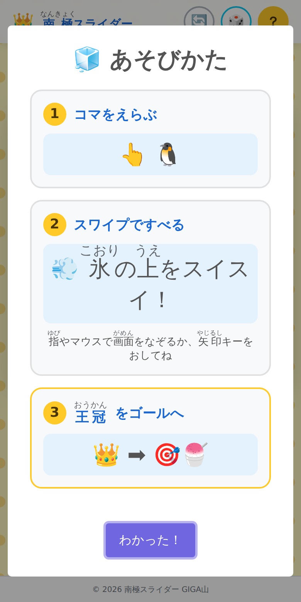

あそびかた。コマをえらぶ、すべる、王冠をゴールへ。この3枚だけです。

自分のばんになったら、動かしたいコマを指でタップします。えらばれたコマは少し大きくなって、まわりが黄色く光ります。どれをえらんだか、離れて見ている子にも分かるようにしてあります。

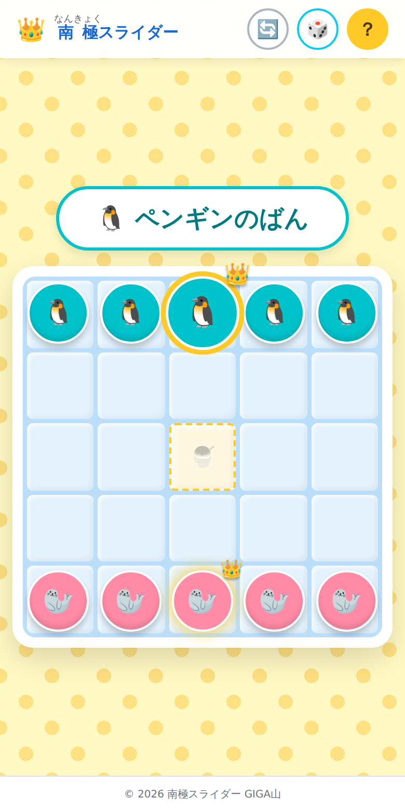

王冠のコマをえらんだところ。ひとまわり大きくなって光ります。

えらんだら、動かしたい方向へ画面をなぞります。パソコンなら矢印キーでもかまいません。コマはその方向へすべり出します。

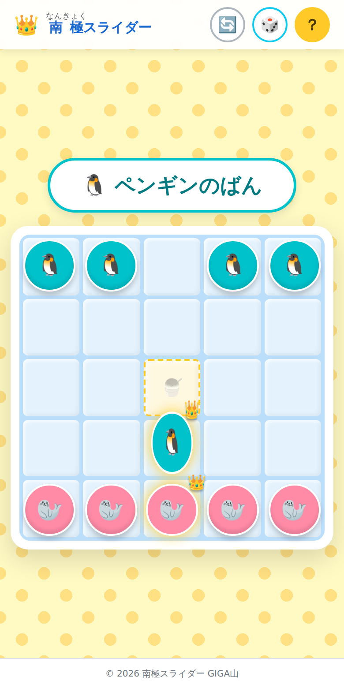

すべっている最中。進む向きに合わせてコマが少し伸びます。

そしてここが、このゲームのいちばん大事なところです。すべり出したコマは、途中で止まれません。壁にぶつかるか、ほかのコマにぶつかるまで、ずっとすべり続けます。

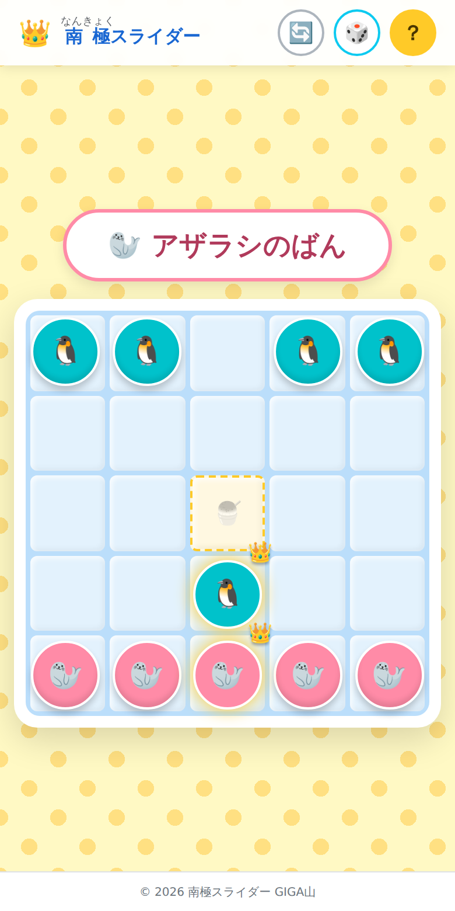

下へすべらせた王冠のコマ。ゴールを通りこして、相手のコマの手前まで行ってしまいました。

止まった瞬間、コマがぐにゅっとつぶれて元に戻ります。ぶつかった感じを目で分かるようにしたかったので、ここだけは少していねいに作りました。どこで止まったのかが一目で分かると、次の手を考えはじめるのが早くなります。

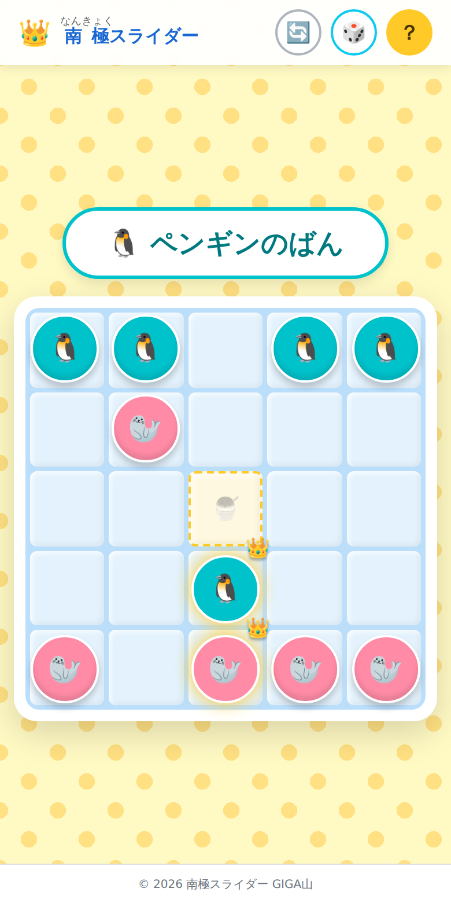

アザラシのコマを上へすべらせたところ。ペンギンのコマにぶつかって、その手前で止まりました。

そのままでは、王冠のコマはゴールを素通りしてしまいます。ゴールでぴたりと止めるには、ゴールの向こう側に何かを置いて、壁のかわりにしなければなりません。

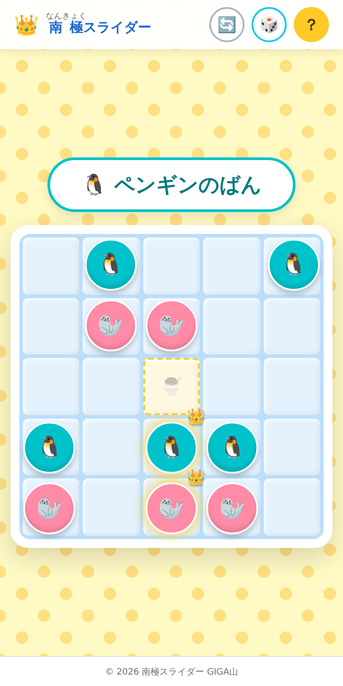

ゴールのすぐ上にアザラシのコマが入りました。この下から王冠のコマを上へすべらせれば、ゴールで止まります。

そして、ぴたりと止まったとき。

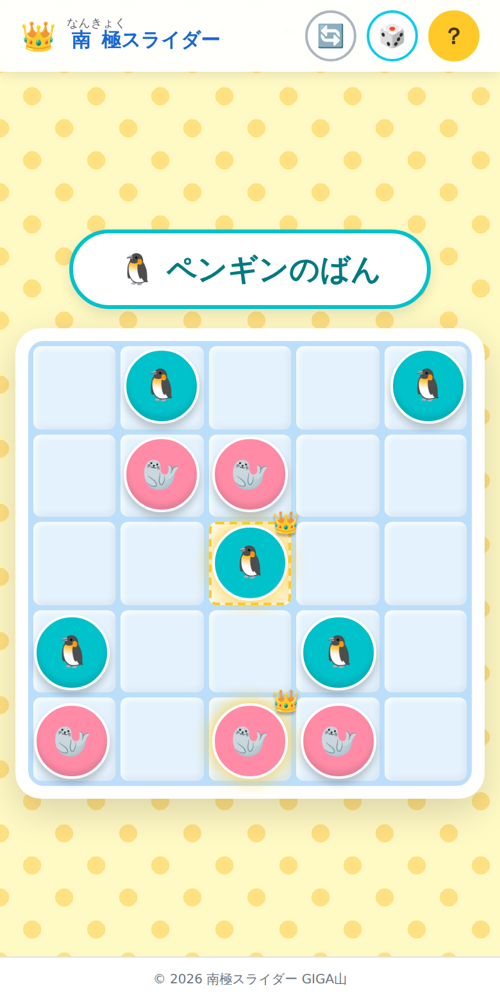

王冠のコマがゴールのマスで止まりました。

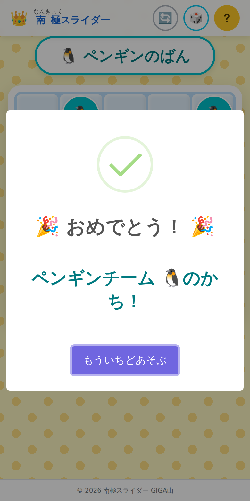

勝つと、お祝いの画面が出ます。ボタンを押せば、そのまま次の一局が始まります。

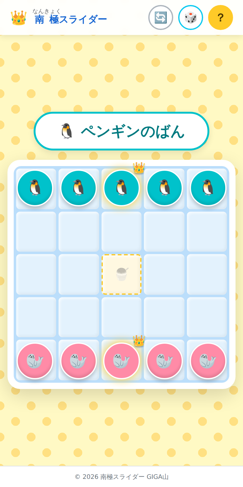

もういちどあそぶを押すと、すぐ最初の並びに戻ります。この記事の画面を撮るために通しで一局遊んだときは、両チーム合わせて7手で決まりました。

チームの見分けは、色だけに頼らないようにしました。ペンギンとアザラシで絵そのものを変えてあるので、色の見え方が人とちがう子でも、白黒で印刷した画面を見ても、どちらのコマかが分かります。王冠のコマも、光らせるだけでなく冠の絵をのせています。見分けを色に任せてしまうと、見えづらい子にとってはただの丸が並んでいるだけの盤面になってしまいます。

音は最後まで鳴りません。制限時間もありません。クラス全員が一斉に開いても静かなままですし、考えこんでしまった子が時間切れで負けることもありません。急がせる仕掛けを入れると、遅い子ほど楽しめなくなってしまうと考えたからです。

## 🧊 止まれないから、頭を使う

このゲームのルールは、いま書いた3つで全部です。それでも、やってみると案外考えることになります。理由は「止まれない」からです。

行きたいマスに行けないのです。すべり出したら最後、ぶつかるまで止まらないので、まずぶつかる相手を用意しなければなりません。自分のコマを先に置いておくのか、相手のコマを利用するのか。そこを考えることになります。

しかも、その壁は相手にも使えてしまいます。自分がゴールの手前に置いた壁を、相手が王冠の足場にしてしまうこともあります。だから、良さそうな手ほど一度立ち止まって考えることになります。

守りかたも同じ考えかたです。相手の王冠がゴールの手前まで来てしまったとき、その向こう側で壁になっているのが自分のコマなら、すべらせてどかしてしまえばいい。壁が消えれば、相手の王冠はゴールを通りこしていきます。攻めるのも守るのも、壁を置くかどかすかという一つの操作でつながっています。

将棋のようにたくさんの手を覚える必要はありません。覚えることは3つのままです。それでも、1手先を読むかどうかで結果が変わります。ルールの少なさと、考えることの多さを両立させたくて、あえてコマの種類を増やしませんでした。特殊な動きをするコマも、アイテムも入れていません。増やせば増やすほど、説明の時間が伸びてしまうからです。

もう一つ、あえて入れなかったものがあります。離れた端末どうしをつなぐ対戦です。作ろうと思えば作れたのですが、そうすると相手を探す時間が要りますし、つながらなかったときに先生が呼ばれます。誰と誰が組むかで、もめることもあるでしょう。1台の端末を2人でのぞきこむ形にしておけば、そのどれも起きません。隣の席の子と、机をくっつけるだけで始まります。画面が1つしかないので、相手が何を考えて手を止めているのかも見えます。すきま時間に遊ぶなら、この形がいちばん軽いと考えました。

## 🎲 サイコロを押すと、盤面が変わる

同じ並びで何度も遊んでいると、そのうち「この手を打てば勝てる」という形を見つける子が出てきます。それ自体はうれしいことなのですが、その子ばかりが勝ち続けると、相手の子はつまらなくなってしまいます。

そこで、右上にサイコロのボタンを置きました。押すと、10個のコマが盤の上にばらばらに並び直されます。

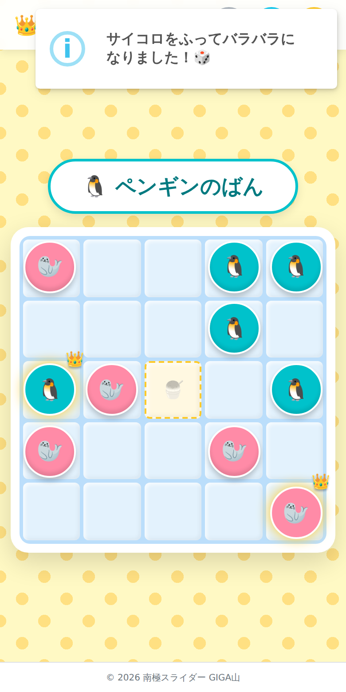

サイコロを押すと、右上に知らせが出ます。

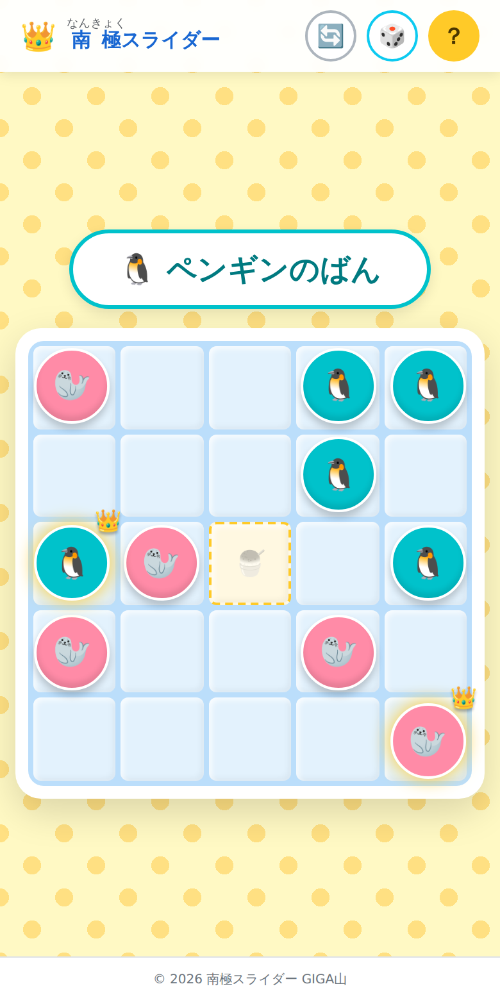

並び直したあと。王冠のコマがどこに来るかも毎回変わります。

覚えた形が通用しなくなるので、勝ち負けが固定しにくくなります。ゴールのマスにだけはコマが置かれないようにしてあります。いきなり王冠がゴールの上にいて、始まった瞬間に終わってしまうのを防ぐためです。

強い子が手加減するのではなく、盤面のほうが毎回変わる。そういう形にしておけば、勝った子も負けた子も、次の一局に素直に向かえるのではないかと思っています。

## ✨ 導入のメリット

三つのいいことが期待できます。

一つ目は、説明にかかる時間がほとんど要らないことです。先生が前で話すのは「まん中のかき氷に、王冠のコマを止めたら勝ち」の一言で足ります。あとは、あそびかたのボタンを押すように言えば、子どもたちが自分で読みます。ふりがながふってあるので、読めなくて手が止まる子も少ないはずです。5分しかないときに、説明で3分使ってしまう心配がなくなります。

二つ目は、先生が気をつけることが少ないことです。このゲームは、名前もクラスも学年も聞きません。誰が何回勝ったかも、どこにも残りません。端末の中にも、インターネットの向こうにも記録が残らないので、共用の端末で次の子が使っても、前の子の情報が出てくることはありません。持ち出しや情報の扱いについて、情報担当の先生に相談する材料が少なくて済みます。

三つ目は、一局が短いことです。手数が少ないので、数分あれば決着がつきます。負けた子がその場でもう一局に入れるので、悔しい気持ちを長く引きずらずに済むのではないかと考えました。時間が来たら、どの局面であっても端末を閉じさせて大丈夫です。途中で終わって困る記録が、そもそも無いからです。「あと1回だけ」と言われて延びてしまうことも起きにくいはずです。次の1回もすぐ終わると、子どものほうが分かっているからです。

## 🛠️ 【管理者向け】導入手順

情報担当の先生に確認されそうなところを、先にまとめておきます。

インストールは要りません。次のアドレスを開くだけです。

https://gigayama.github.io/Ice_slide-puzzle/

校内のフィルタリングで許可が必要になるかもしれないアドレスは3つあります。

まず gigayama.github.io です。ゲーム本体が置いてあるところで、ここが通っていないと開けません。残りの2つは fonts.googleapis.com と fonts.gstatic.com で、どちらも文字の形を読みこむためのものです。

あとの2つは、通してもらえなくてもかまいません。読みこめなかったときは端末にもともと入っている書体に切りかえるようにしてあるので、見た目が少し変わるだけで、遊ぶのに支障はありません。実際、私がこのゲームを作って確かめた環境ではこの2つが塞がれており、その状態のまま全部の画面を確認しています。

集めている情報はありません。名前も、成績も、勝った回数も記録しません。ゲームの中で外へ出ていく通信は、いま書いた文字の形の読みこみだけです。それ以外の行き先へは、ブラウザの設定でつなげないようにしてあります。子どもの操作した内容がどこかへ送られることはありません。

共用の端末でも、そのまま使えます。遊んだ記録が端末の中に残らないので、次の子が開いたときには、いつも同じまっさらな盤面から始まります。前の子の名前や勝敗が出てくることはありません。逆に言うと、続きから再開することもできません。すきま時間に遊ぶものなので、続きを持ち越す必要はないと考えて、そうしました。

一斉に開いても重くならないように、読みこむものを軽くしてあります。アイコンなどの画像は全部合わせて44キロバイトです。以前は1.3メガバイトありましたが、色数の少ない絵なのでそこまで持つ必要がなく、96パーセント落としました。40人が同じ時間に同じ Wi-Fi でつなぐ場面では、この差がそのまま最初の待ち時間になります。

端末に入れて使うこともできます。ブラウザのメニューから「アプリをインストール」あるいは「ホーム画面に追加」を選ぶと、ふつうのアプリのようにアイコンから開けるようになります。一度開いておけば、そのあとはインターネットにつながっていなくても遊べます。校外学習の移動中や、Wi-Fi の調子が悪い日でも止まりません。

つながっていないうえに、まだ一度も開いたことがない端末では、次の画面が出ます。真っ白な画面のまま固まって「壊れた」と言われるのを避けるために用意しました。

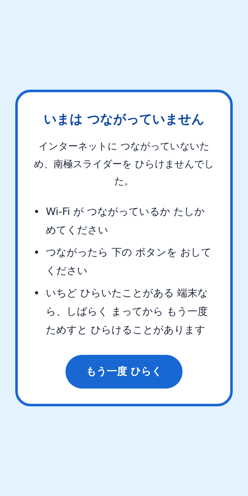

圏外のときに出る画面。ここも、ふりがなをふって子どもが自分で読めるようにしてあります。

端末に入れるときの操作は、機種によって呼びかたが変わります。Chromebook なら、アドレスの右側に出るインストールのアイコンです。iPad の Safari なら、共有のボタンから「ホーム画面に追加」を選びます。入れなくてもブラウザでそのまま遊べますので、迷ったら入れずに使ってもらってかまいません。

ゲームを新しくしたときは、勝手に切りかわらないようにしてあります。画面の下に案内が出て、押してもらうまで前のままで動き続けます。対戦のとちゅうで急に画面が入れかわって、それまでの盤面が消えてしまうのを防ぐためです。管理する側で配り直す作業は要りません。子どもが案内を押したときに、その端末だけが新しくなります。

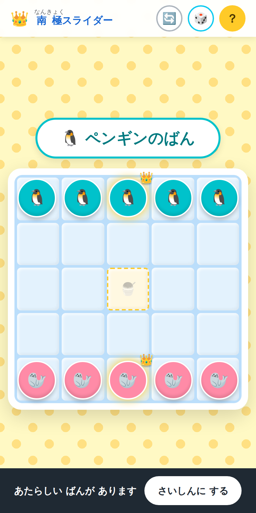

新しい版が出たときの案内。押すまでは、いま遊んでいる盤面がそのまま残ります。

画面の大きさは選びません。教室でよく使われる形は一通り確かめてあります。

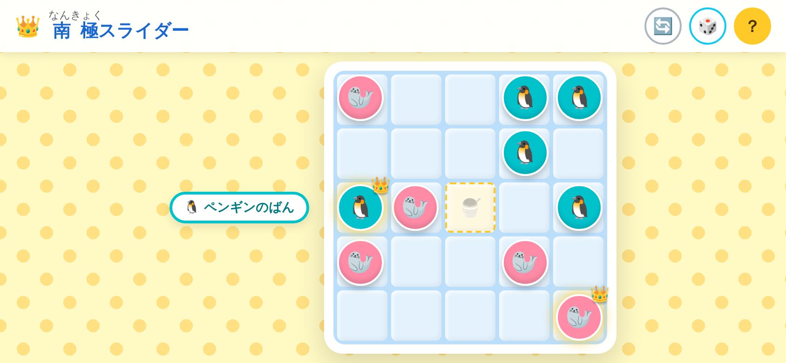

タブレットを横向きにしたところ。どちらのばんかを示す表示が、盤面の左へ移ります。

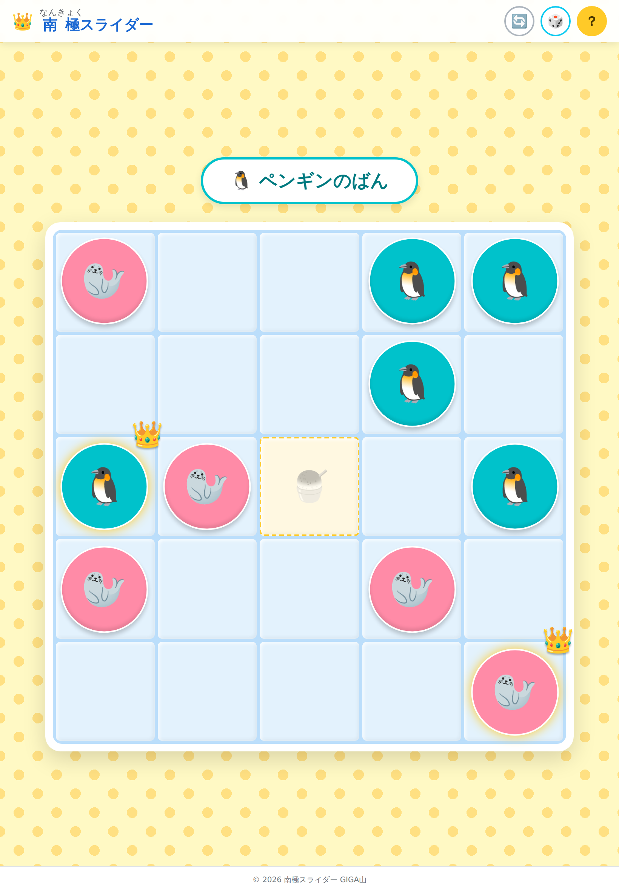

タブレットの縦向き。盤面が画面いっぱいまで大きくなります。

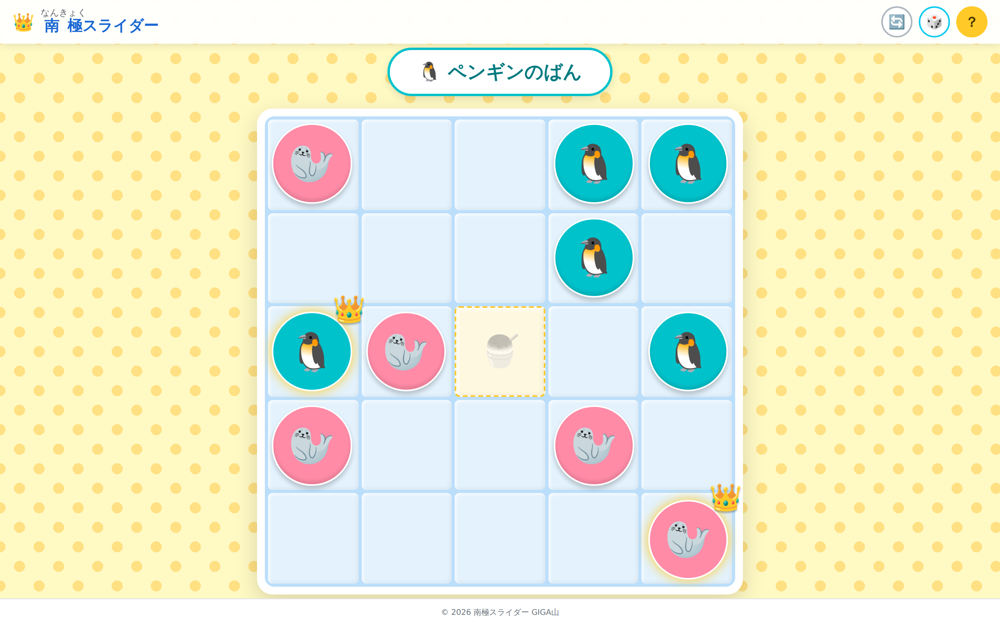

パソコンの画面。2人でのぞきこむには、この大きさがいちばん見やすいと思います。

画面を指で広げて大きくすることもできます。細かい字が見えづらい子のために、拡大を禁止していません。盤面を指でなぞる操作とはぶつからないようにしてあるので、大きくしたまま遊んでも困りません。

色の見え方やボタンの押しやすさについても、文字と背景の濃さ、押せる範囲の大きさを一つずつ測って直してあります。測った結果は、リポジトリの中の点検記録にまとめてあります。

## 📖 【利用者向け】使い方のガイド

子どもたちに伝えるときの手順です。そのまま画面に映して読ませることもできます。

1. ブラウザで https://gigayama.github.io/Ice_slide-puzzle/ を開きます
2. 右上の「？」ボタンを押して、あそびかたを読みます。読み終わったら「わかった！」を押します
3. 2人で1台の端末を囲みます。上のペンギンチームと、下のアザラシチームに分かれます
4. 自分のばんになったら、動かしたいコマを指でタップします。えらんだコマは大きくなって光ります
5. 動かしたい方向へ、画面を指でなぞります。パソコンのときは矢印キーか、WASD のキーを押します
6. コマは壁かほかのコマにぶつかるまで止まりません。どこで止まるか考えてからなぞります
7. 王冠のついたコマを、まん中のかき氷のマスでぴたりと止めたら勝ちです
8. 勝ったら「もういちどあそぶ」を押します。すぐ次の一局が始まります
9. 同じ並びに飽きたら、右上のサイコロのボタンを押します。コマがばらばらに並び直ります
10. 途中でやめたくなったら、右上のやりなおしのボタンで最初の並びに戻ります

パソコンで遊ぶときは、コマをクリックしてから矢印キーを押す形になります。

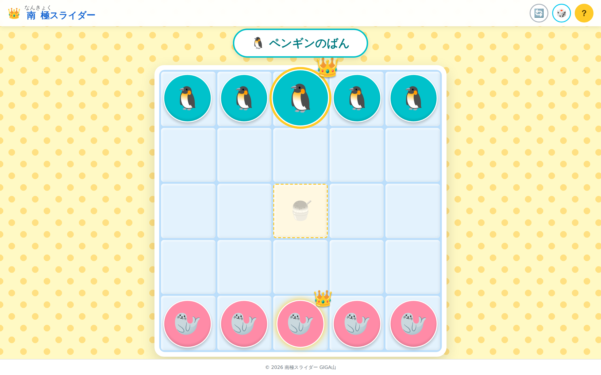

パソコンでコマをえらんだところ。ここで矢印キーを押すと、その向きへすべります。

うまく動かないときは、まずコマがえらばれているか確かめてください。えらばれていれば、コマがひとまわり大きくなって黄色く光っています。光っていないときは、もう一度コマをタップしてから、なぞり直します。

## 📝 まとめ

このゲームを作りながら考えていたのは、教室で余ってしまう5分のことでした。

その5分に、先生が新しい何かを準備するのは大変です。かといって、ただ待たせるのももったいない。だったら、準備の要らないものを一つ手もとに置いておけばいいのではないか。開くだけで始まって、チャイムが鳴ったら閉じるだけで終わる。そういうものがあれば、先生はその5分のあいだ、教室を歩いて子どもたちの様子を見ていられるのではないかと思いました。

ICT を使うことの良さは、作業が速くなることそのものではないと私は思っています。速くなったぶんで空いた時間を、子どもと向き合うことに使えるところにあるはずです。説明に3分かけていたものが10秒で済めば、残りの時間は子どもたちの手もとを見て回る時間になります。負けて悔しがっている子の隣に立てる時間になります。それが、道具を使う本当の理由ではないでしょうか。

小さなゲームですが、どこかの教室の5分を埋める役に立てば、これほどうれしいことはありません。うまくいかなかったところや、こうだったらいいのにと思ったところがあれば、ぜひ教えてください。作った本人が気づけないことのほうが、たいてい多いのです。

まずは先生ご自身が、職員室で一局やってみてください。隣の先生を誘って2分あれば足ります。おそらく1回では終わらないと思います。

一歩踏み出そうとする先生を、私はいつでも全力で応援しています。
